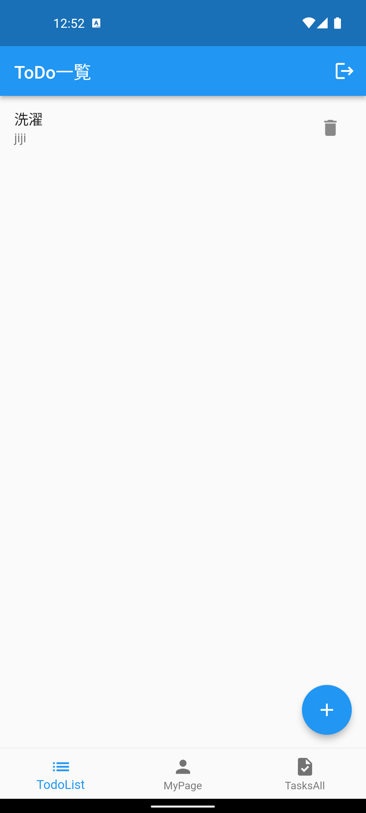

# TodoList

このリポジトリでは、Flutterを用いてTodoListアプリを開発しました。アプリはFirebase、GoRouter、Freezed、およびProviderを使用しています。また、MVVMアーキテクチャを採用して開発が行われました。機能としては、以下のものが含まれています。

- ログイン機能
- 新規登録機能
- 個人のTodoList表示ページ
- Todo追加ページ
- みんなのTodoListを表示するページ

これらの技術と機能を組み合わせることで、ユーザーがタスクを追加、編集、削除し、アプリ間でリアルタイムにデータが同期される機能を提供しています。また、MVVMアーキテクチャを用いることで、コードの整理とメンテナンス性が向上しています。

下記が動作画面のスクリーンショットです。

 

 

 

 

 

 

